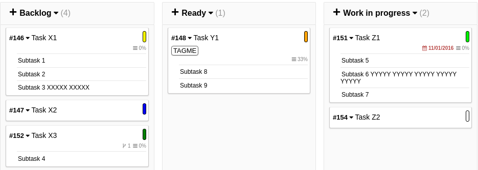

# Not maintained

# Show subtasks below tasks on main board

This will render the subtasks on board.



## Todo

Subtasks "disappear" when moving tasks.

## How to
#### Prerequisites

Clone this repo into the **kanboard/Plugins**.

`git clone`

Optional:

Use this plugin [KanboardCSS](https://gitlab.com/ThomasTJ/KanboardCSS)

#### Step 1
Add the following to **Controller/BoardViewController** in the function `show()`:

`$subtasksAll = $this->kanboardSubtasksBoardModel->KanboardSubtasksBoardGetAll($project);`

`'subtasks' => $subtasksAll,`

It should then look like this (snippet):

```PHP
<?php
public function show()
{
    $project = $this->getProject();
    $search = $this->helper->projectHeader->getSearchQuery($project);

    $subtasksAll = $this->kanboardSubtasksBoardModel->KanboardSubtasksBoardGetAll($project); // Code 1

    $this->response->html($this->helper->layout->app('board/view_private', array(
        'subtasks' => $subtasksAll, // Code 2
        'project' => $project,
        'title' => $project['name'],
        'description' => $this->helper->projectHeader->getDescription($project),
        'board_private_refresh_interval' => $this->configModel->get('board_private_refresh_interval'),
        'board_highlight_period' => $this->configModel->get('board_highlight_period'),
        'swimlanes' => $this->taskLexer
            ->build($search)
            ->format(BoardFormatter::getInstance($this->container)->withProjectId($project['id']))
    )));
}
?>
```


#### Step 2
Add the following to ***view_private.php***:

`'subtasks' => $subtasks,`

It should look like this:

```PHP
<section id="main">

    <?= $this->projectHeader->render($project, 'BoardViewController', 'show', true) ?>

    <?= $this->render('board/table_container', array(
        'subtasks' => $subtasks,
        'project' => $project,
        'swimlanes' => $swimlanes,
        'board_private_refresh_interval' => $board_private_refresh_interval,
        'board_highlight_period' => $board_highlight_period,
    )) ?>

</section>
```


#### Step 3
Add the following to **table_container.php**:

`'subtasks' => $subtasks,`

It should look like this (snippet):
```PHP
<?= $this->render('board/table_tasks', array(
    'subtasks' => $subtasks,
    'project' => $project,
    'swimlane' => $swimlane,
    'not_editable' => isset($not_editable),
    'board_highlight_period' => $board_highlight_period,
)) ?>
```

#### Step 4
Add the following to **table_tasks.php**:

`'subtasks' => $subtasks,`

It should look like this (snippet):

```PHP
<?php foreach ($column['tasks'] as $task): ?>
    <?= $this->render($not_editable ? 'board/task_public' : 'board/task_private', array(
        'subtasks' => $subtasks,
        'project' => $project,
        'task' => $task,
        'board_highlight_period' => $board_highlight_period,
        'not_editable' => $not_editable,
    )) ?>
<?php endforeach ?>
```


#### Step 5
Add the following in **task_private.php**:

`'subtasks' => $subtasks,`

It should look like this (snippet):

```PHP
<?= $this->render('board/task_footer', array(
    'subtasks' => $subtasks,
    'task' => $task,
    'not_editable' => $not_editable,
    'project' => $project,
)) ?>
```


#### Step 6
Make the following changes in **task_footer.php**:

Insert the code right above this:

`<?= $this->hook->render('template:board:task:icons', array('task' => $task)) ?>`

Code:
```PHP
<?php if (! empty($task['nb_subtasks'])): ?>

    <?php foreach($subtasks as $subtasks){
        if ($subtasks['subtasks_status'] == "0" && $subtasks['tasks_id'] == $task['id']){
    ?>
            <div class="taskdetails" style="margin-left: 15px; text-align: left;">
            <hr class="taskseparator"/>
            <span style="color: black; opacity: 1; font-size: 12px;"title="<?= t('Sub-Tasks') ?>" class="tooltip" data-href="<?= $this->url->href('BoardTooltipController', 'subtasks', array('task_id' => $task['id'], 'project_id' => $task['project_id'])) ?>"><?php print $subtasks['subtasks_title']; ?></span>
            </div>
    <?php
        }
    } ?>

<?php endif ?>
```
